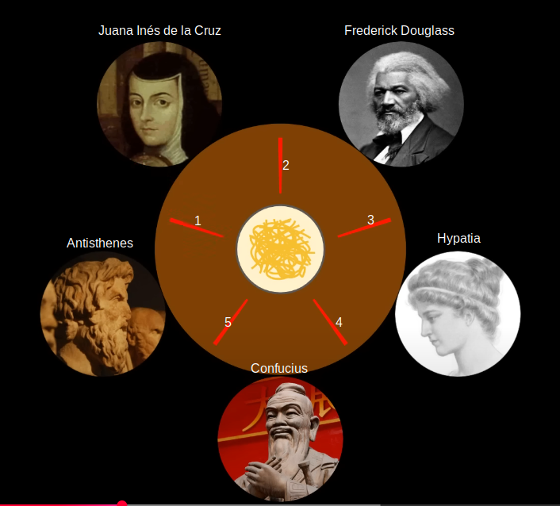

# 10_deadlock_starvation

  
Story:
There are 5 philosopher and a table at dining hall. There are 5 chop sticks and a noodle on top of table. Philosopher are hungry. They need to share chop sticks to eat the noodle. They need 2 chopstick to be able to eat noodle. Since they can concurrently take chop sticks, they may block each other. Demos below demonstrates how to solve this problem.  
  
<mark>demo_chair.c</mark>  
If philosopher sits on even numbered chair, s/he gets left chop stick first. S/he gets right chopstick after left chopstick. Starts eating and after some time leaves chopstick at the table to share. If philosopher sits on odd numbered chair, order picking chopsticks is vice versa.
```
../shell/rebuild_run_qemu.sh . -DDEMO_CHAIR_C:BOOL=ON
```

<mark>demo_deadlock.c</mark>  
Each philosophers gets chopstick to their left and then tries to get right one. Since all of them got left chopstick and not willing to share they are blocked. They go hungry.
```
../shell/rebuild_run_qemu.sh . -DDEMO_DEADLOCK_C:BOOL=ON
```

<mark>demo_livelock.c</mark>  
Each philosophers tries to get chopstick to their left and then tries to get right one. If they can not get it for some time, they get disappointed and leaves the chop stick back at the table.  

In this demo, all of them gets first chop stick at the same time and leaves at the same time. None of them have 2 chop stick to be able eat at a given time. They go hungry.
```
../shell/rebuild_run_qemu.sh . -DDEMO_LIVELOCK_C:BOOL=ON
```

<mark>demo_stick_prio.c</mark>  
A priority is given to each chop stick. Philosopher needs to pickup the chop stick with highest priority first.
```
../shell/rebuild_run_qemu.sh . -DDEMO_STICK_PRIO_C:BOOL=ON
```
  
[Introduction to RTOS Part 10 - Deadlock and Starvation](https://www.youtube.com/watch?v=hRsWi4HIENc&list=PLEBQazB0HUyQ4hAPU1cJED6t3DU0h34bz&index=10)  
  

## Terminal Output
Making sense of terminal output:  
* **waiting** s/he has no chop stick, just waits to get it
* **got left** s/he got the left chop stick
* **:)** s/he similing because gets to eat
* **:D** s/he laughes because ate something
* **gave left** s/he put back left chop stick at the table
* **:/ left** s/he is dissapointed because:
    * put back the chop stick at the table without eating
    * was not able to get it in first place
* led toggle is their party light
  
<mark>Happy log from DEMO_CHAIR_C</mark>
```
Hypatia waiting  
Confucius waiting  
Antisthenes waiting  
Cruz waiting  
Douglass waiting  
Hypatia got left  
Antisthenes got right  
Cruz got left  
Hypatia :)  
Antisthenes :)  
Hypatia :D  
Antisthenes :D  
Hypatia gave right  
Antisthenes gave left  
Cruz :)  
Hypatia gave left  
Hypatia waiting  
Confucius got right  
Antisthenes gave right  
Antisthenes waiting  
Confucius :)  
Cruz :D  
```

## Notes
Use demo_init function in demo.c to implement your demo application.
Run in debug console to dump the trace  
-exec dump binary value trace.bin *RecorderDataPtr