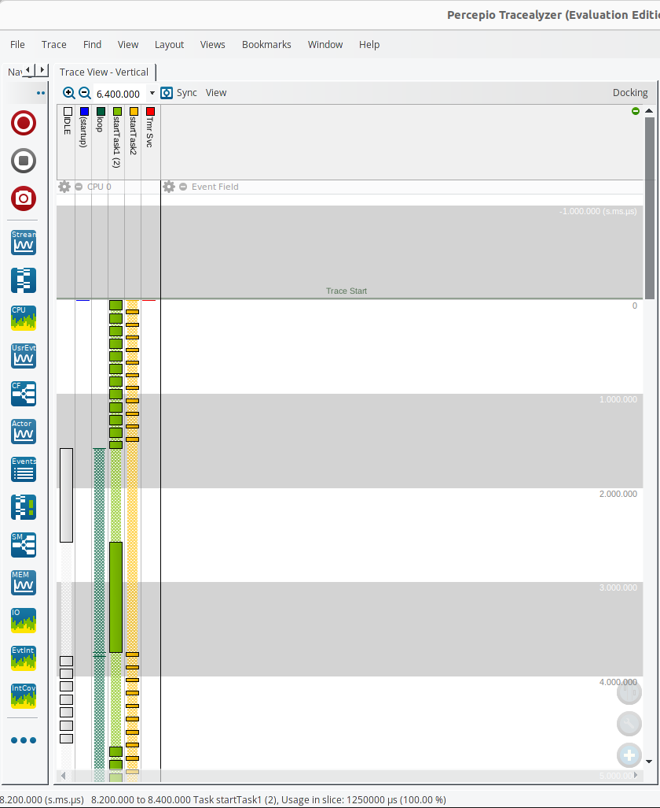

# 3_task_scheduling

Implementation in [app.c](./app.c).

[Introduction to RTOS Part 3 - Task Scheduling | Digi-Key Electronics](https://www.youtube.com/watch?v=95yUbClyf3E&list=PLEBQazB0HUyQ4hAPU1cJED6t3DU0h34bz&index=3)

Task2 has higher priority and preempts task1.


## Terminal Output
```
*Bar*kad*eer* b*rig* Ar*r b*oo*ty *rum*.

Barkadeer brig Arr booty rum.
********
B*ar*kad*ee*r *bri*g *Arr* b*oot*y *ru*m.

Barkadeer brig Arr booty rum.
********
B*ar*kad*ee*r b*ri*g A*rr* bo*oty* r*um.*

Barkadeer brig Arr booty rum.
********
B*ar*ka*dee*r *br*ig *Ar*r b*oo*ty* ru*m.*
Task1 deleted.***********
```

## Notes
Use app_init function in app.c to implement your demo application.
Run in debug console to dump the trace  
-exec dump binary value trace.bin *RecorderDataPtr