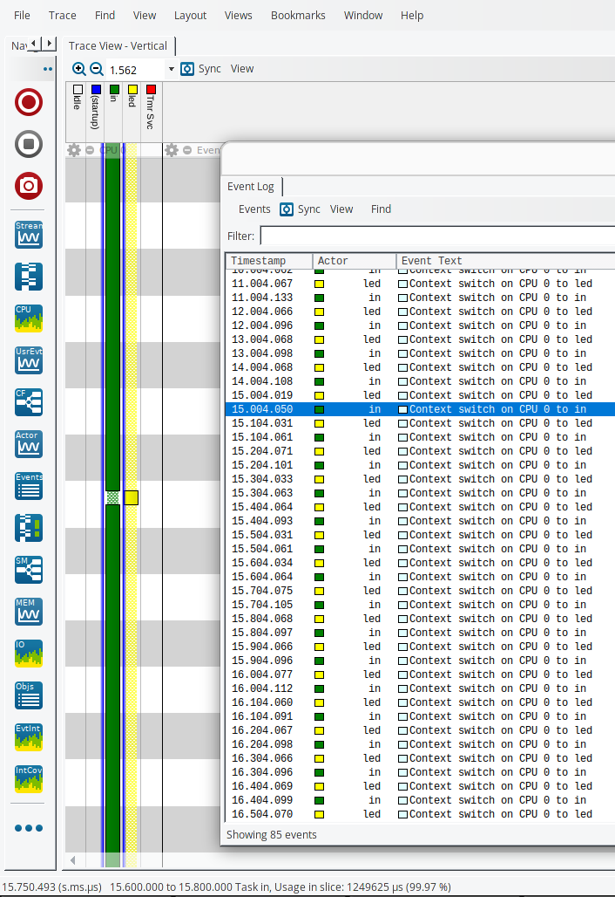

# 3_task_scheduling

Implementation in [demo.c](./demo.c).

```Please ignore race conditions for now```

Challenge of [Introduction to RTOS Part 3 - Task Scheduling | Digi-Key Electronics](https://www.youtube.com/watch?v=95yUbClyf3E&list=PLEBQazB0HUyQ4hAPU1cJED6t3DU0h34bz&index=3)

At highligted timestamp, I(the user) entered 100 ms request. You could see context switch of led task timestamp are now 100ms intervals.


## Terminal Output
```
LED: 1
Enter LED delay(ms): 

LED: 0
LED: 1
LED: 0
LED: 1
LED: 0
LED: 1
LED: 0
LED: 1
LED: 0
LED: 1
LED: 0
LED: 1
LED: 0
LED: 1

Led delay updated to(ms): 100
LED: 0
LED: 1
LED: 0
LED: 1
LED: 0
LED: 1
LED: 0
LED: 1
LED: 0
LED: 1
LED: 0
LED: 1
LED: 0
LED: 1
LED: 0
LED: 1
LED: 0
LED: 1
LED: 0
LED: 1
LED: 0
LED: 1
LED: 0
```

## Notes
Use app_init function in demo.c to implement your demo application.
Run in debug console to dump the trace  
-exec dump binary value trace.bin *RecorderDataPtr