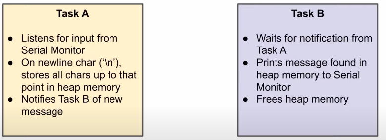

# 4_memory_challenge

Implementation in [demo.c](./demo.c).

```Please ignore race conditions for now```

Challenge of [Introduction to RTOS Part 4 - Memory Management ](https://www.youtube.com/watch?v=Qske3yZRW5I&list=PLEBQazB0HUyQ4hAPU1cJED6t3DU0h34bz&index=4)



## Terminal Output

## Notes
Use app_init function in demo.c to implement your demo application.
Run in debug console to dump the trace  
-exec dump binary value trace.bin *RecorderDataPtr