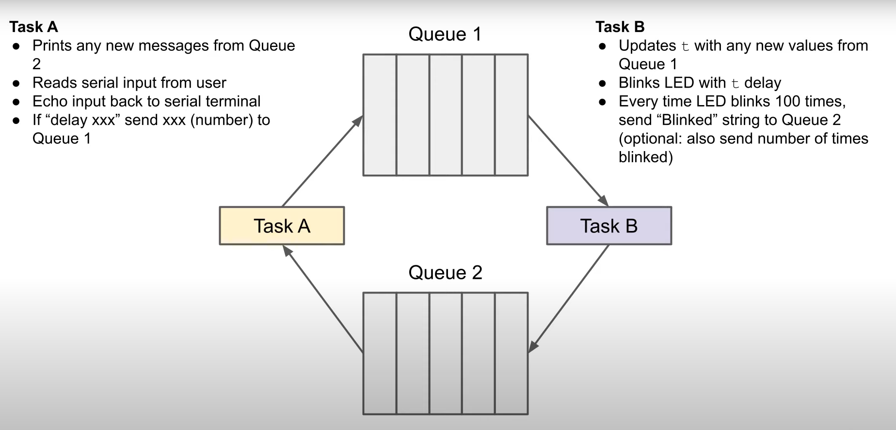

# 5_queue_challenge
```
../shell/rebuild_run_qemu.sh .
```
Challenge of [Introduction to RTOS Part 5 - Queue](https://www.youtube.com/watch?v=pHJ3lxOoWeI&list=PLEBQazB0HUyQ4hAPU1cJED6t3DU0h34bz&index=5)



## Terminal Output

## Notes
Use demo_init function in demo.c to implement your demo application.
Run in debug console to dump the trace  
-exec dump binary value trace.bin *RecorderDataPtr