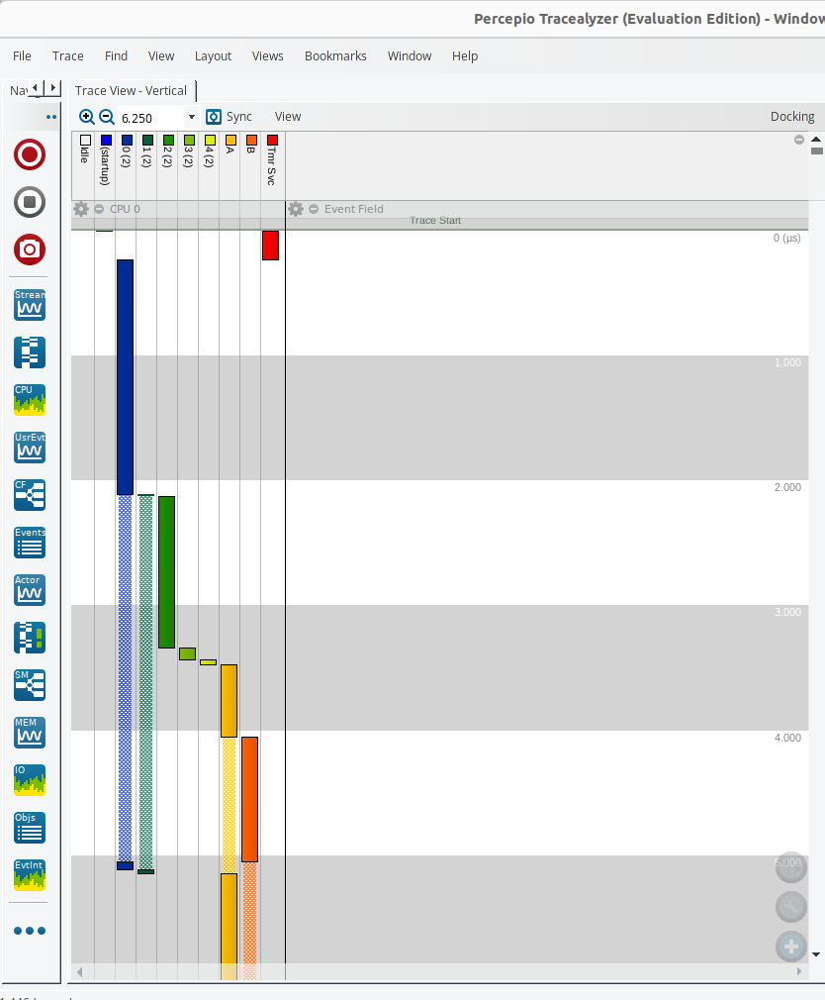

# 7_semaphore_challenge

[Introduction to RTOS Part 7 - Semaphore](https://www.youtube.com/watch?v=5JcMtbA9QEE&list=PLEBQazB0HUyQ4hAPU1cJED6t3DU0h34bz&index=7)

Interesting trace to see how some producers take longer than others because they wait for semaphore or mutex.


## Terminal Output
```
1
1
1
2
2
2
3
3
3
4
4
4
0
0
0
```
## Notes
Use demo_init function in demo.c to implement your demo application.
Run in debug console to dump the trace  
-exec dump binary value trace.bin *RecorderDataPtr