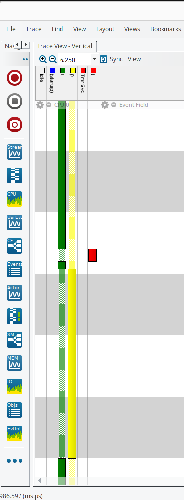

# 9_hw_int

Two demos available. Pass one of the arguments to CMake.  
```
demo_tm.c
DEMO_TM_C:BOOL=ON
```
```
demo_adc.c
DEMO_ADC_C:BOOL=ON
```
```
default
DEMO_ADC_C:BOOL=ON
```
  
[Introduction to RTOS Part 9 - Hardware Interrupts](https://www.youtube.com/watch?v=qsflCf6ahXU&list=PLEBQazB0HUyQ4hAPU1cJED6t3DU0h34bz&index=9)  
  
As he explains while loop is running, interrupt occurs then OS switches to printValue.  
Purpose isr should be as short as possible. You let other task to handle information. This called deferred interrupt.  


## Terminal Output

## Notes
Use demo_init function in demo.c to implement your demo application.
Run in debug console to dump the trace  
-exec dump binary value trace.bin *RecorderDataPtr